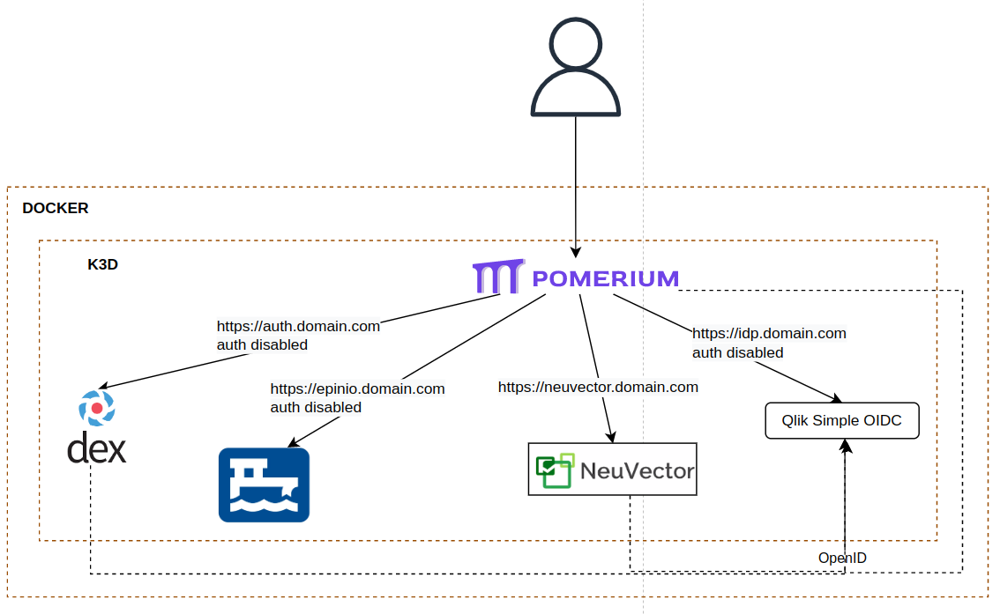

### Local Architecture



### Deploying Epinio - locally with IP address + sslip.io
 **Note:** Deploy without valid ssl is not working

~~`make install-epinio`~~

### Deploying Epinio - in dev mode with wildcard SSL certificates from letsencrypt in AWS EC2/C9
`DOMAIN=subdomain.maindomain.com make install-epinio`

Note: Make sure you have the following fields in your Makefile
```
export AWS_ACCESS_KEY_ID  ?= "AKIAXXXXSMF"
export AWS_HOSTED_ZONE_ID ?= "Z082XXXXOSYA06"
export AWS_SECRET_ACCESS_KEY ?= "wO6NGXasdasdZ0Ns/ZbCx6a"
```

### Important 
#### K3D deployment
- OIDC default user is `admin@example.com` and password is `password`
- After the first epinio cli login, using default credentials of Oidc user, run the command bellow to grant *admin* role to it.

```
kubectl get secret -n epinio $(kubectl get secret -n epinio | grep ruser-orbitadmspeedy | awk '{print $1}') -o json | jq --arg EPINIO_ROLE "admin" '.metadata.labels["epinio.io/role"]=$EPINIO_ROLE' | kubectl apply -f -
```
#### Docker deployment (obsolet)
~~- Local OIDC is running over HTTP, so check if your browser can access HTTP urls~~
~~- OIDC default user is `admin@example.com` and password is `password`~~
~~- K3D cluster is exposing 8080 and 8443 ports.~~
~~- Check if pomerium and oidc containers successfully started (docker contianer ls -a)~~
~~- After the first epinio cli login, using default credentials of Oidc user, run the command bellow to grant *admin* role to it.~~

### Neuvector OpenID Setup
- Identity Provider Issuer: http://idp.YOUR_DOMAIN:9000
- ClientID: neuvector_id
- SecretID: neuvector_secret
- Group Claim: Everyone
- Default Role: Admin

Enable and Save

Now do Logout and try to login using OpenID